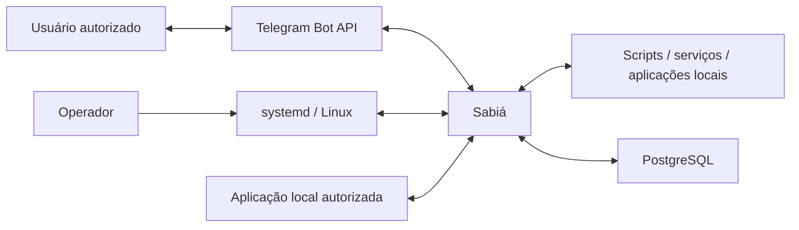
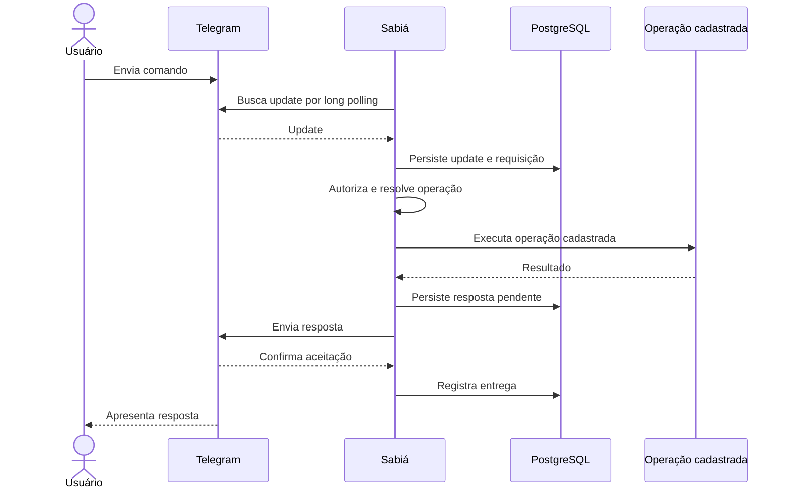
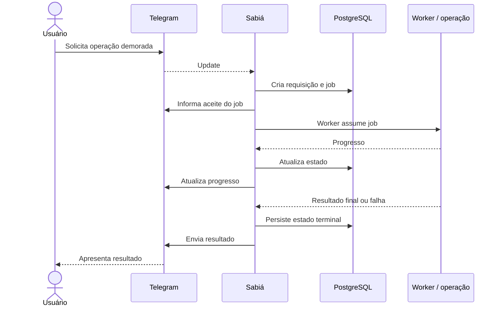
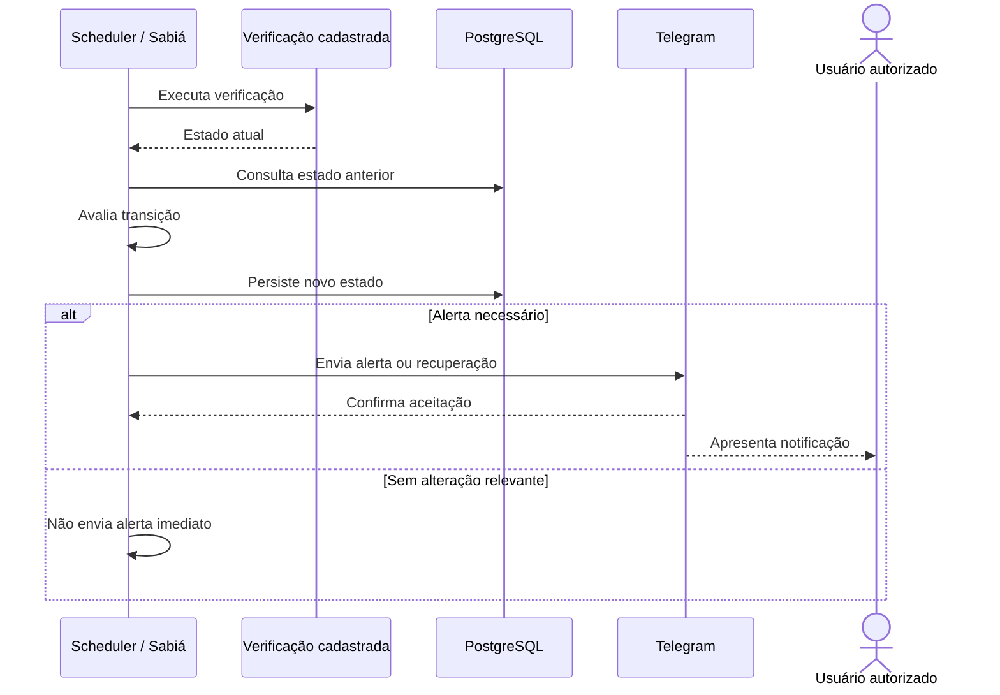
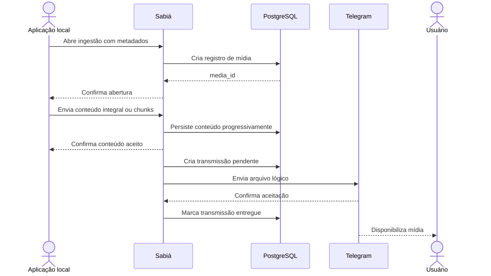
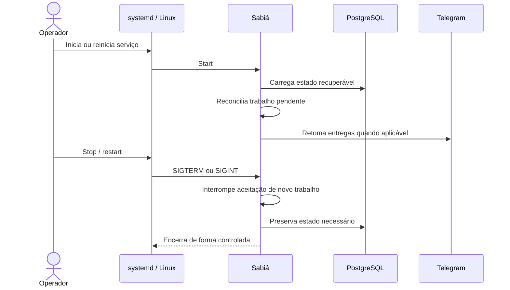

# Sabiá — Scope Statement

## Referência

Project Charter: [PROJECT-CHARTER.md](PROJECT-CHARTER.md)

## Visão geral

O Sabiá é um serviço Linux do ecossistema Bioma que intermedeia, de forma controlada, usuários autorizados no Telegram, operações locais previamente cadastradas, jobs assíncronos, verificações agendadas, alertas e transporte de mídia.

O Telegram é o canal remoto inicial. Aplicações locais podem interagir somente por interfaces explicitamente autorizadas. O Sabiá mantém a correlação entre entrada, processamento, estado persistente e destino de resposta sem transformar mensagens recebidas em shell arbitrário.

## Fronteira do sistema

### Onde começa

A responsabilidade do Sabiá começa quando ocorre um dos seguintes eventos:

- um cliente Telegram habilitado recebe um update;
- uma aplicação local autorizada solicita uma operação por interface publicada pelo Sabiá;
- uma aplicação local autorizada inicia a ingestão de mídia;
- o scheduler interno identifica uma verificação cadastrada que deve ser executada;
- o serviço inicia ou reinicia e precisa recuperar trabalho operacional persistido.

### Onde termina

A responsabilidade do Sabiá termina, conforme o fluxo, quando:

- uma resposta ou mídia é aceita pelo Telegram e o resultado da entrega é registrado;
- uma requisição ou job chega a um estado terminal e o resultado correspondente é persistido;
- uma ingestão local é recusada de forma controlada ou aceita e persistida;
- uma verificação agendada atualiza o estado operacional e, quando aplicável, produz a notificação correspondente;
- o Sabiá registra falhas controladas sem transferir para o usuário acesso direto aos recursos internos.

A lógica específica executada por scripts, aplicações ou processadores externos não passa a fazer parte do domínio do Sabiá apenas por ser acionada por ele.

## Atores

| ID | Ator | Objetivo | Ponto de entrada |
|---|---|---|---|
| ACT-001 | Usuário Telegram autorizado | Executar comandos permitidos, consultar estado, acompanhar jobs e receber resultados. | Cliente Telegram habilitado. |
| ACT-002 | Operador do Sabiá | Instalar, configurar e administrar clientes, credenciais, operações, schedules e permissões. | Ambiente Linux, configuração e systemd. |
| ACT-003 | Aplicação ou serviço local autorizado | Integrar operações e enviar mídia sem depender diretamente da Telegram Bot API. | Interfaces locais autorizadas do Sabiá. |

## Canais e dispositivos

| Canal / dispositivo | Uso | Obrigatório? |
|---|---|---|
| Aplicativo Telegram em dispositivo do usuário | Envio de comandos e recebimento de mensagens, progresso, alertas e mídias. | sim para ACT-001 |
| Unix domain socket local | Ingestão de mídia por aplicações locais autorizadas. | sim para IN-007 |
| Ambiente Linux / systemd / configuração local | Instalação, ciclo de vida e administração operacional. | sim para ACT-002 |

## Sistemas externos

| Sistema | Papel | Controlado pelo projeto? |
|---|---|---|
| Telegram Bot API | Receber updates e aceitar mensagens ou mídias enviadas pelo Sabiá. | não |
| Scripts, aplicações e serviços locais cadastrados | Executar operações específicas solicitadas ou agendadas. | não |
| PostgreSQL | Persistir o estado operacional necessário ao funcionamento e recovery. | não |
| systemd | Iniciar, parar, reiniciar e supervisionar o processo do Sabiá. | não |
| Sistema operacional Linux | Fornecer identidade, permissões, sinais e ambiente de execução. | não |

## System Context

## Dentro do escopo

| ID | Capacidade | Descrição | Objetivo relacionado | Fluxos |
|---|---|---|---|---|
| IN-001 | Clientes Telegram isolados | Operar clientes Telegram independentes, inicialmente `bioma`, `tools` e `alerts`, cada um com identidade, autorização e catálogo próprios. | OBJ-001, OBJ-006 | FLW-001, FLW-003 |
| IN-002 | Autorização explícita | Validar identidade do usuário e, quando configurado, o contexto de chat antes da execução de operações. | OBJ-006 | FLW-001 |
| IN-003 | Roteamento de operações cadastradas | Resolver comandos para operações previamente cadastradas sem executar texto ou caminhos arbitrários fornecidos pelo usuário. | OBJ-001, OBJ-006 | FLW-001 |
| IN-004 | Jobs assíncronos | Aceitar operações demoradas como jobs, controlar fila, estados, progresso e resultado sem bloquear novos comandos. | OBJ-002, OBJ-005 | FLW-002 |
| IN-005 | Scheduler e alertas | Executar verificações cadastradas, comparar estados e produzir alertas por transição, recuperação ou lembrete configurado. | OBJ-003, OBJ-005 | FLW-003 |
| IN-006 | Persistência operacional e recovery | Persistir correlações, requisições, jobs, mensagens pendentes, mídia, transmissões e estados necessários à retomada após restart. | OBJ-005 | FLW-001, FLW-002, FLW-003, FLW-004, FLW-005 |
| IN-007 | Ingestão local de mídia | Receber mídia de aplicações autorizadas por canal simples ou fracionado e persistir o conteúdo antes de confirmar a aceitação. | OBJ-004, OBJ-005 | FLW-004 |
| IN-008 | Entrega de mídia | Correlacionar mídia persistida a uma requisição/destino e transmiti-la pelo cliente Telegram correto. | OBJ-004, OBJ-005 | FLW-004 |
| IN-009 | Operação segura como serviço Linux | Executar com identidade dedicada, integração com systemd, graceful shutdown, configuração protegida e registros sem segredos ou conteúdo binário. | OBJ-006 | FLW-005 |

## Fora do escopo

| ID | Exclusão | Motivo |
|---|---|---|
| OUT-001 | Execução de shell, comando ou caminho arbitrário recebido do Telegram. | Operações devem ser previamente cadastradas e autorizadas. |
| OUT-002 | Recebimento de updates do Telegram por webhook público no primeiro MVP. | O canal inicial utiliza long polling. |
| OUT-003 | Exposição de HTTP/REST, gRPC ou TCP como canal remoto do primeiro MVP. | São possibilidades de evolução posterior e não fazem parte da fronteira atual. |
| OUT-004 | Implementação, no primeiro MVP, de processadores complexos de imagem, vídeo e áudio. | O MVP fornece a infraestrutura de jobs e transporte, mas não esses processadores especializados. |
| OUT-005 | Acesso direto de aplicações locais ao PostgreSQL, credenciais ou diretórios internos do Sabiá como mecanismo de integração. | Integrações locais devem ocorrer somente pelas interfaces autorizadas. |
| OUT-006 | Execução do processo principal como root. | O projeto adota menor privilégio e identidade Linux dedicada. |
| OUT-007 | Compartilhamento implícito de comandos, scripts, permissões ou credenciais entre clientes Telegram. | Cada cliente possui isolamento lógico próprio. |

## Integrações

| ID | Origem | Destino | Propósito | Direção | Entrada | Saída | Obrigatória | Status de conhecimento | Discovery |
|---|---|---|---|---|---|---|---|---|---|
| INT-001 | Sabiá | Telegram Bot API | Receber updates e entregar mensagens/mídias. | bidirecional | Updates e confirmações do serviço remoto | Chamadas de leitura, envio e edição | sim | DOCUMENTED | - |
| INT-002 | Sabiá | Operações locais cadastradas | Executar scripts ou aplicações permitidas e obter seus resultados. | bidirecional | Identificador resolvido, argumentos validados e correlação da requisição | Resultado, estado, progresso ou falha | sim | DOCUMENTED | - |
| INT-003 | Aplicação local autorizada | Sabiá | Ingerir mídia associada a uma requisição. | entrada | Metadados e conteúdo integral ou fracionado | ACK, identificador de mídia ou erro controlado | sim para produtores de mídia | DOCUMENTED | - |
| INT-004 | Sabiá | PostgreSQL | Persistir e recuperar estado operacional. | bidirecional | Estado de requisições, jobs, mensagens, mídia, transmissões e alertas | Estado persistido e registros recuperados | sim | DOCUMENTED | - |
| INT-005 | systemd / Linux | Sabiá | Gerenciar ciclo de vida, identidade e encerramento do serviço. | bidirecional | Start, stop, sinais e ambiente | Estado do processo e encerramento controlado | sim | DOCUMENTED | - |

## Entradas

| Entrada | Origem | Validação em alto nível |
|---|---|---|
| Update Telegram | Telegram Bot API | Cliente habilitado, update ainda não processado, identidade e contexto autorizados. |
| Comando e argumentos | Usuário Telegram autorizado | Comando cadastrado, quantidade/formato de argumentos e regras da operação. |
| Mídia recebida do Telegram | Telegram Bot API | Tipo suportado, associação à requisição e limites definidos pelo fluxo de mídia. |
| Solicitação local de ingestão de mídia | ACT-003 | Identidade local autorizada, correlação válida e limites do canal utilizado. |
| Configuração operacional | ACT-002 | Estrutura válida, referências conhecidas e ausência de segredos versionados. |
| Saída ou progresso de operação cadastrada | INT-002 | Correlação com requisição/job e contrato esperado pela operação. |
| Sinal de ciclo de vida | Linux / systemd | Sinal reconhecido pelo processo. |

## Saídas

| Saída | Destino | Resultado esperado |
|---|---|---|
| Mensagem de resposta | Telegram Bot API | Entrega ao cliente e destino correlacionados à requisição. |
| Atualização de progresso | Telegram Bot API | Usuário acompanha evolução de operação assíncrona. |
| Alerta | Telegram Bot API | Mudança relevante, recuperação ou lembrete configurado é comunicada. |
| Mídia persistida | Telegram Bot API | Arquivo lógico é transmitido sem expor armazenamento interno ao usuário. |
| Chamada de operação cadastrada | Script, aplicação ou serviço local | Somente uma operação previamente resolvida e autorizada é executada. |
| Estado operacional persistido | PostgreSQL | Trabalho e correlações necessários permanecem recuperáveis. |
| Logs e auditoria | Ambiente operacional | Eventos relevantes são registrados sem segredos nem payloads binários. |

## Cenários de uso

| Cenário | Ator | Canal | Fluxo |
|---|---|---|---|
| Executar comando Telegram | ACT-001 | Telegram | FLW-001 |
| Executar operação demorada | ACT-001 | Telegram | FLW-002 |
| Receber alerta automático | ACT-001 | Telegram | FLW-003 |
| Entregar mídia produzida localmente | ACT-003 | Unix domain socket + Telegram | FLW-004 |
| Reiniciar o serviço preservando trabalho operacional | ACT-002 | systemd / Linux | FLW-005 |

## Fluxos de alto nível

### FLW-001 — Comando Telegram

**Objetivo:** processar um comando autorizado e devolver sua resposta pelo mesmo contexto de cliente.  
**Ator inicial:** ACT-001  
**Pré-condições:** cliente habilitado; credencial disponível; usuário autorizado.  
**Integrações:** INT-001, INT-002, INT-004  
**Itens de escopo:** IN-001, IN-002, IN-003, IN-006

#### Sequência

#### Resultado esperado

A requisição é processada uma única vez do ponto de vista lógico e a resposta é enviada pelo cliente e destino correlacionados.

#### Falhas relevantes

- usuário ou chat não autorizado;
- comando inexistente ou argumentos inválidos;
- falha temporária ou permanente da Telegram Bot API;
- falha da operação cadastrada;
- indisponibilidade da persistência necessária ao processamento.

### FLW-002 — Job assíncrono

**Objetivo:** executar trabalho demorado sem bloquear o tratamento de novos comandos.  
**Ator inicial:** ACT-001  
**Pré-condições:** comando autorizado e operação classificada para processamento assíncrono.  
**Integrações:** INT-001, INT-002, INT-004  
**Itens de escopo:** IN-004, IN-006

#### Sequência

#### Resultado esperado

O job evolui por estados controlados, pode informar progresso e termina com resultado ou falha sem impedir o processamento de outros comandos.

#### Falhas relevantes

- fila indisponível;
- timeout ou falha do processador;
- interrupção do serviço;
- falha na entrega da atualização ou resultado.

### FLW-003 — Monitoramento agendado e alerta

**Objetivo:** executar uma verificação cadastrada e notificar somente quando a política de estado exigir.  
**Ator inicial:** Scheduler interno  
**Pré-condições:** schedule e operação de verificação cadastrados.  
**Integrações:** INT-001, INT-002, INT-004  
**Itens de escopo:** IN-005, IN-006

#### Sequência

#### Resultado esperado

Mudanças relevantes, recuperações e lembretes configurados podem gerar notificação; repetição de um mesmo estado não produz alerta imediato por padrão.

#### Falhas relevantes

- verificação retorna estado desconhecido ou falha;
- Telegram indisponível;
- estado anterior não pode ser recuperado.

### FLW-004 — Ingestão e entrega de mídia local

**Objetivo:** receber mídia de produtor local autorizado, persistir o conteúdo e entregá-lo pelo contexto Telegram correlacionado.  
**Ator inicial:** ACT-003  
**Pré-condições:** produtor autorizado e requisição/destino correlacionável.  
**Integrações:** INT-003, INT-004, INT-001  
**Itens de escopo:** IN-006, IN-007, IN-008

#### Sequência

#### Resultado esperado

Mídia aceita permanece persistida e pode ser transmitida ao destino correto, inclusive após restart enquanto ainda estiver pendente.

#### Falhas relevantes

- produtor sem autorização local;
- payload acima do limite permitido no canal escolhido;
- sequência de chunks inválida;
- mídia incompleta;
- falha temporária ou permanente na transmissão externa.

### FLW-005 — Inicialização, recovery e encerramento

**Objetivo:** iniciar e encerrar o serviço preservando consistência do trabalho operacional.  
**Ator inicial:** ACT-002 / systemd  
**Pré-condições:** instalação e configuração operacional disponíveis.  
**Integrações:** INT-004, INT-005, INT-001  
**Itens de escopo:** IN-006, IN-009

#### Sequência

#### Resultado esperado

O processo inicia com recuperação do estado relevante e encerra sem depender de execução como root ou perda silenciosa de trabalho persistente.

#### Falhas relevantes

- PostgreSQL indisponível durante startup;
- configuração inválida;
- trabalho interrompido sem estado recuperável;
- falha de comunicação externa durante a retomada.

## Restrições

| ID | Restrição | Impacto no escopo |
|---|---|---|
| CON-001 | O serviço é destinado ao ambiente Linux e é gerenciado pelo systemd. | Administração e lifecycle são definidos para Linux. |
| CON-002 | Telegram utiliza long polling no primeiro MVP; webhook público não faz parte do fluxo atual. | O Sabiá inicia conexões de saída para receber updates. |
| CON-003 | O processo principal não executa como root. | Operações que exijam privilégios adicionais precisam de mecanismo externo explicitamente controlado. |
| CON-004 | Usuário remoto nunca fornece shell ou caminho arbitrário para execução. | Toda operação precisa existir previamente no catálogo configurado. |
| CON-005 | PostgreSQL é obrigatório para o estado operacional persistente. | Recovery e filas dependem dessa integração. |
| CON-006 | Clientes Telegram são isolados por identidade, autorização e catálogo. | Comandos e permissões não são compartilhados implicitamente. |
| CON-007 | Interfaces locais compartilhadas utilizam autorização do ambiente Linux e não concedem acesso direto ao armazenamento interno. | ACT-003 interage somente pelas interfaces publicadas. |
| CON-008 | Ingestão simples de mídia aceita no máximo 20 MB; o canal fracionado usa chunks de até 5 MB e total de até 100 MB. | Arquivos acima do limite simples precisam usar ingestão fracionada e arquivos acima do total permitido são recusados. |

## Premissas

| ID | Premissa | Evidência | Discovery |
|---|---|---|---|
| ASM-001 | A instalação dispõe de conectividade de saída para a Telegram Bot API. | Requisito operacional decorrente do uso de long polling e envio de respostas. | - |
| ASM-002 | Tokens e segredos serão provisionados fora do conteúdo versionado. | Regra estabelecida do projeto. | - |
| ASM-003 | Operações disponibilizadas ao usuário serão cadastradas explicitamente antes do uso. | Regra estabelecida do projeto. | - |
| ASM-004 | PostgreSQL estará disponível com banco lógico e credencial próprios do Sabiá. | Decisão vigente do projeto. | - |
| ASM-005 | Produtores locais autorizados executarão sob identidades habilitadas a utilizar as interfaces locais. | Regra vigente de autorização local. | - |

## Questões abertas

| ID | Questão | Impacto | Bloqueadora? | Discovery |
|---|---|---|---|---|
| OPEN-001 | Quem possui autoridade formal para aprovar mudanças na fronteira deste Scope? | Governança de futuras mudanças de escopo. | não | - |

## Discoveries relacionados

Nenhum Discovery de Project Charter está aberto nesta baseline. As lacunas técnicas existentes em documentos de especificação não alteram, neste momento, a fronteira de alto nível registrada aqui.

## Critério de fechamento

O Scope somente pode atingir `refined` quando fronteira, atores, canais, sistemas externos, itens dentro e fora do escopo, integrações e principais fluxos estiverem claros, não houver contradições conhecidas sobre a fronteira e nenhuma questão bloqueadora permanecer pendente.
