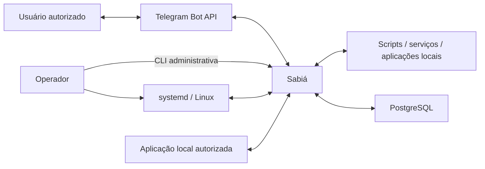

# System Context

## Sistemas externos

| Sistema | Papel | Controlado pelo projeto? |
|---|---|---|
| Telegram Bot API | Receber updates e aceitar mensagens ou mídias enviadas pelo Sabiá. | não |
| Scripts, aplicações e serviços locais cadastrados | Executar operações específicas solicitadas ou agendadas. | não |
| PostgreSQL | Persistir o estado operacional necessário ao funcionamento e recovery. | não |
| systemd | Iniciar, parar, reiniciar e supervisionar o processo do Sabiá. | não |
| Sistema operacional Linux | Fornecer identidade, permissões, sinais e ambiente de execução. | não |

## Diagrama

