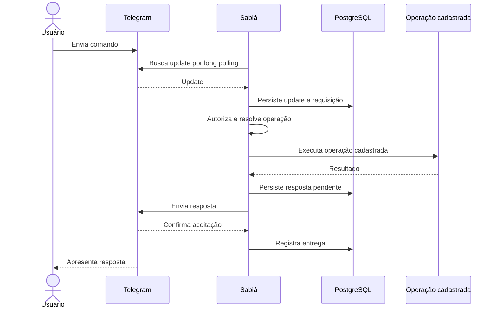

# FLW-001 — Comando Telegram

**Disposition:** active

## Objetivo

processar um comando autorizado e devolver sua resposta pelo mesmo contexto de cliente.  
## Ator inicial

ACT-001  
## Pré-condições

cliente habilitado; credencial disponível; usuário autorizado.  
## Integrações

INT-001, INT-002, INT-004  
## Capacidades

IN-001, IN-002, IN-003, IN-006

## Sequência

## Resultado esperado

A requisição é processada uma única vez do ponto de vista lógico e a resposta é enviada pelo cliente e destino correlacionados.

## Falhas relevantes

- usuário ou chat não autorizado;
- comando inexistente ou argumentos inválidos;
- falha temporária ou permanente da Telegram Bot API;
- falha da operação cadastrada;
- indisponibilidade da persistência necessária ao processamento.
