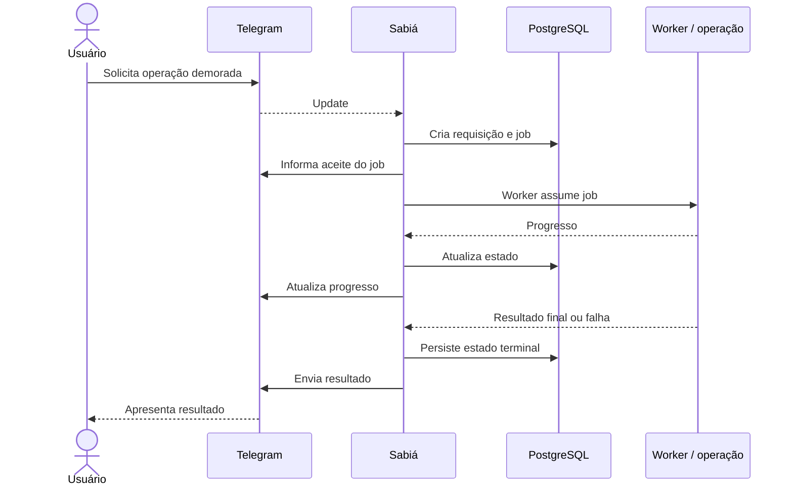

# FLW-002 — Job assíncrono

**Disposition:** active

## Objetivo

executar trabalho demorado sem bloquear o tratamento de novos comandos.  
## Ator inicial

ACT-001  
## Pré-condições

comando autorizado e operação classificada para processamento assíncrono.  
## Integrações

INT-001, INT-002, INT-004  
## Capacidades

IN-004, IN-006

## Sequência

## Resultado esperado

O job evolui por estados controlados, pode informar progresso e termina com resultado ou falha sem impedir o processamento de outros comandos.

## Falhas relevantes

- fila indisponível;
- timeout ou falha do processador;
- interrupção do serviço;
- falha na entrega da atualização ou resultado.
