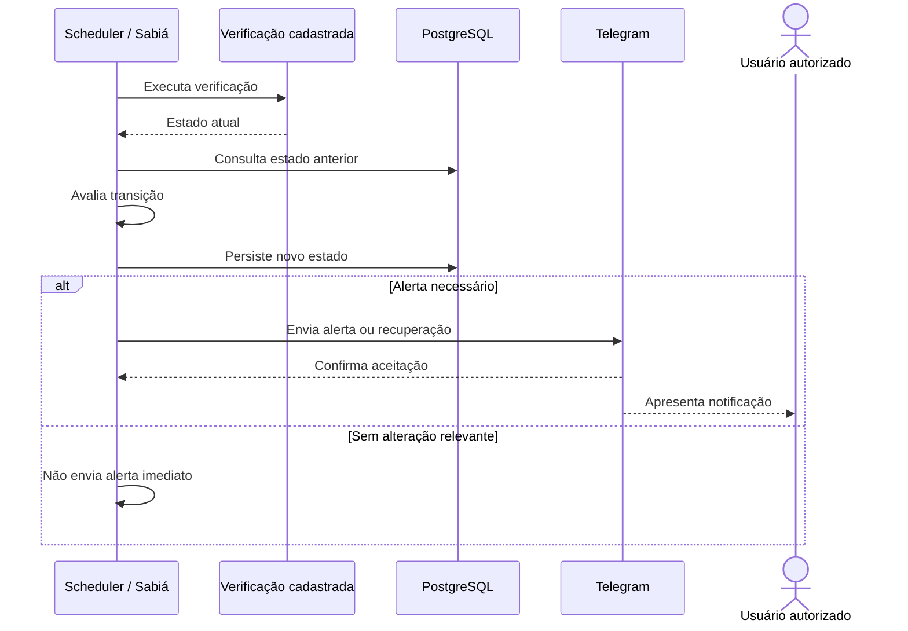

# FLW-003 — Monitoramento agendado e alerta

**Disposition:** active

## Objetivo

executar uma verificação cadastrada e notificar somente quando a política de estado exigir.  
## Ator inicial

Scheduler interno  
## Pré-condições

schedule e operação de verificação cadastrados.  
## Integrações

INT-001, INT-002, INT-004  
## Capacidades

IN-005, IN-006

## Sequência

## Resultado esperado

Mudanças relevantes, recuperações e lembretes configurados podem gerar notificação; repetição de um mesmo estado não produz alerta imediato por padrão.

## Falhas relevantes

- verificação retorna estado desconhecido ou falha;
- Telegram indisponível;
- estado anterior não pode ser recuperado.
