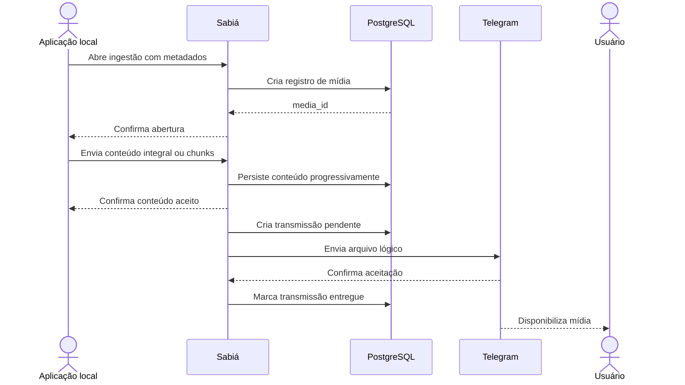

# FLW-004 — Ingestão e entrega de mídia local

**Disposition:** active

## Objetivo

receber mídia de produtor local autorizado, persistir o conteúdo e entregá-lo pelo contexto Telegram correlacionado.  
## Ator inicial

ACT-003  
## Pré-condições

produtor autorizado e requisição/destino correlacionável.  
## Integrações

INT-003, INT-004, INT-001  
## Capacidades

IN-006, IN-007, IN-008

## Sequência

## Resultado esperado

Mídia aceita permanece persistida e pode ser transmitida ao destino correto, inclusive após restart enquanto ainda estiver pendente.

## Falhas relevantes

- produtor sem autorização local;
- payload acima do limite permitido no canal escolhido;
- sequência de chunks inválida;
- mídia incompleta;
- falha temporária ou permanente na transmissão externa.
