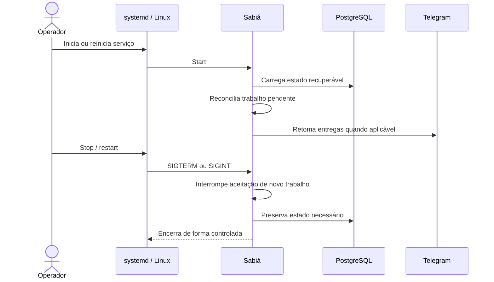

# FLW-005 — Inicialização, recovery e encerramento

**Disposition:** active

## Objetivo

iniciar e encerrar o serviço preservando consistência do trabalho operacional.  
## Ator inicial

ACT-002 / systemd  
## Pré-condições

instalação e configuração operacional disponíveis.  
## Integrações

INT-004, INT-005, INT-001  
## Capacidades

IN-006, IN-009

## Sequência

## Resultado esperado

O processo inicia com recuperação do estado relevante e encerra sem depender de execução como root ou perda silenciosa de trabalho persistente.

## Falhas relevantes

- PostgreSQL indisponível durante startup;
- configuração inválida;
- trabalho interrompido sem estado recuperável;
- falha de comunicação externa durante a retomada.
