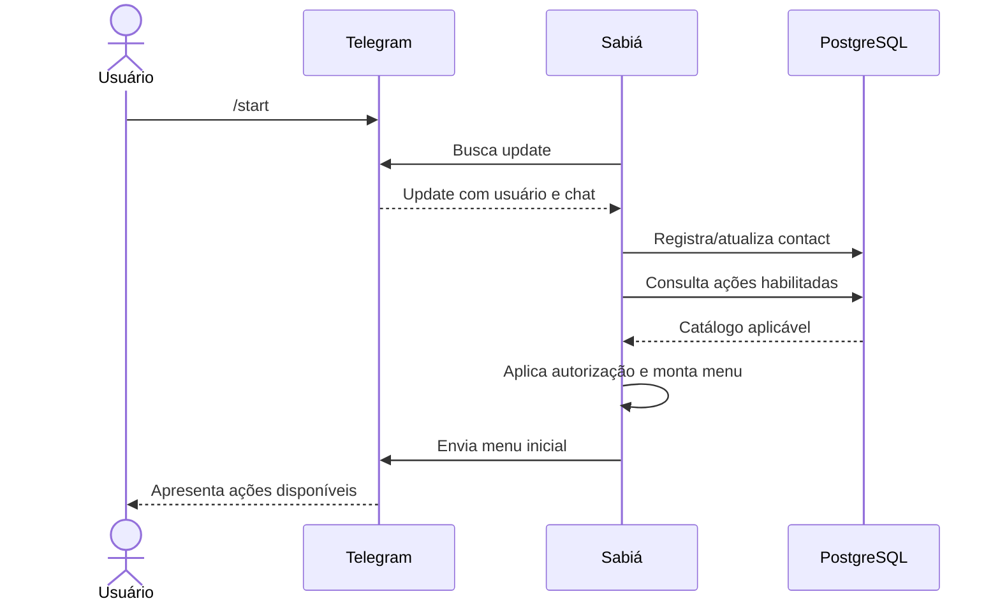

# FLW-006 — /start, registro de contato e apresentação do menu

**Disposition:** active

## Objetivo

registrar ou atualizar o contato que iniciou interação com o cliente Telegram e apresentar as ações disponíveis para aquele contexto.  
## Ator inicial

ACT-001  
## Pré-condições

cliente Telegram habilitado.  
## Integrações

INT-001, INT-004  
## Capacidades

IN-001, IN-002, IN-006, IN-010, IN-011

## Sequência

## Resultado esperado

O contato fica persistido e o usuário recebe uma representação do menu baseada no catálogo de ações. O cadastro do contato não amplia automaticamente suas permissões.

## Falhas relevantes

- dados mínimos de identidade/destino ausentes;
- persistência indisponível;
- falha no envio do menu;
- contato conhecido, porém sem autorização para ações restritas.
