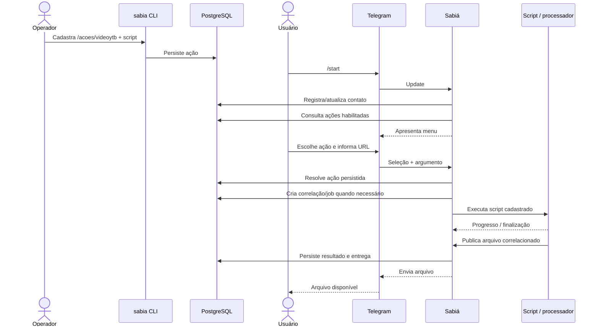

# FLW-007 — Cadastro administrativo e execução de ação persistente

**Disposition:** active

## Objetivo

permitir que uma ação seja cadastrada pelo operador e posteriormente utilizada pelo usuário sem que o usuário remoto conheça ou escolha o caminho do script.  
## Ator inicial

ACT-002 e ACT-001  
## Pré-condições

operador com acesso administrativo local; cliente Telegram habilitado; ação válida e habilitada.  
## Integrações

INT-001, INT-002, INT-004  
## Capacidades

IN-003, IN-004, IN-006, IN-008, IN-010, IN-011, IN-012

## Sequência

## Resultado esperado

O operador consegue ampliar o catálogo sem recompilar o Sabiá. O usuário aciona a ação pelo menu, fornece somente os argumentos permitidos e recebe progresso, mensagem ou arquivo produzido pela operação.

## Falhas relevantes

- ação inexistente, desabilitada ou não autorizada;
- definição administrativa inválida;
- script/processador inexistente ou indisponível;
- argumento inválido, como URL fora do domínio aceito;
- timeout ou falha do processamento;
- falha na publicação ou entrega do arquivo.
