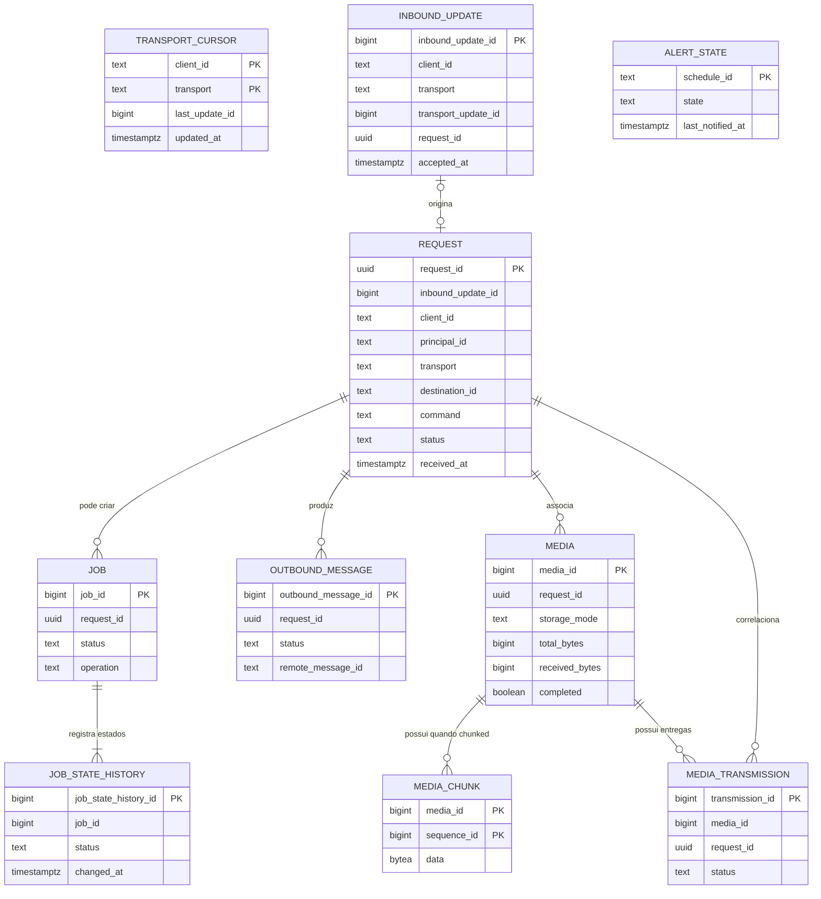

# Relacionamentos do estado operacional

**ID:** PST-0002  
**Status:** refinement

## Objetivo

Representar os relacionamentos e cardinalidades propostos entre as tabelas de PST-0001, permitindo revisão do modelo antes da implementação.

Este documento não altera contratos existentes. Enquanto estiver em `refinement`, cardinalidades e políticas de integridade aqui descritas são propostas para aprovação.

## Dependências

- [ADR-0009 — Persistência do estado operacional em PostgreSQL](../../adr/persistencia/estado-operacional.md)
- [PST-0001 — Proposta de tabelas do estado operacional](tabelas-estado-operacional.md)
- [CTR-0003 — Job](../contratos/job.md)
- [CTR-0006 — Mídia persistida](../contratos/midia-persistida.md)
- [CTR-0007 — Transmissão persistente de mídia](../contratos/transmissao-midia.md)
- [FLW-0001 — Comando Telegram](../fluxos/comando-telegram.md)
- [FLW-0003 — Monitoramento agendado](../fluxos/monitoramento-agendado.md)
- [PST-0100 — Entidades persistentes](entidades/README.md)
- [CTR-0010 — Origem e conversão dos dados persistentes](../contratos/origem-dados-persistencia.md)
- [FLW-0009 — Registro do estado operacional](../fluxos/registro-estado-operacional.md)
- [FLW-0010 — Consumo do estado operacional](../fluxos/consumo-estado-operacional.md)

## Detalhamento das entidades

O diagrama abaixo representa relacionamentos. A origem, conversão, tipos e exemplos de cada tabela ficam em [PST-0100 — Entidades persistentes](entidades/README.md).

## Visão geral

`TRANSPORT_CURSOR`, `ALERT_STATE` e `SCHEMA_VERSION` não precisam de FK entre si ou com as demais tabelas para atender os contratos atuais.

## Relações propostas

### `inbound_update → request`

**Cardinalidade proposta:** `0..1 : 0..1`.

Motivo:

- FLW-0001 exige persistir o update antes de avançar o offset;
- autorização ocorre depois desse aceite;
- um update persistido pode não produzir uma requisição executável;
- quando houver requisição, a correlação deve ser única.

Proposta:

- `request.inbound_update_id` como FK opcional;
- `UNIQUE(request.inbound_update_id)` quando não nulo;
- `inbound_update.request_id` é redundante se a FK existir em `request`.

**Ponto para revisão:** escolher somente uma direção física para evitar duplicação. A proposta preferida é manter a FK apenas em `request.inbound_update_id` e remover `inbound_update.request_id` de PST-0001 caso esta relação seja aprovada.

### Ciclo de vida da request

`request.status` usa `received → processing → completed | failed` e representa apenas o processamento pelo Core.

O estado da request é independente do estado do job e das entregas. Uma request assíncrona pode estar `completed` enquanto seu job permanece `queued` ou `running`, e uma request concluída pode possuir mensagens ou mídias ainda pendentes de entrega.

O `request_id` é UUID v4 persistido como PostgreSQL `uuid`.

Quando a tarefa associada termina, a correlação passa a ser elegível para o processo de limpeza. A remoção efetiva deve respeitar as dependências: não remover request, job ou correlação enquanto existirem jobs não terminais, mensagens `pending/sending` ou transmissões `pending/transmitting` associadas.

### `request → job`

**Cardinalidade normativa:** `1 : 0..N`.

Uma requisição pode criar zero ou vários jobs. Não existe restrição de unicidade em `job.request_id`.

FK:

`job.request_id → request.request_id`.

### `job → job_state_history`

**Cardinalidade proposta:** `1 : 1..N`.

Todo job deve possuir ao menos o estado inicial persistido.

FK proposta:

`job_state_history.job_id → job.job_id`.

Regra transacional proposta:

- criação do job e primeiro histórico na mesma transação;
- mudança de `job.status` e inclusão do histórico correspondente na mesma transação.

### `request → outbound_message`

**Cardinalidade proposta:** `1 : 0..N`.

Uma requisição pode produzir confirmação, progresso e resultado final. Não é proposta restrição de uma única mensagem por requisição.

FK proposta:

`outbound_message.request_id → request.request_id`.

### `request → media`

**Cardinalidade:** `1 : 0..N`.

Esta relação já é compatível com CTR-0006: uma mesma `request_id` pode possuir vários registros de mídia, inclusive com nome/conteúdo repetidos.

FK proposta:

`media.request_id → request.request_id`.

### `media → media_chunk`

**Cardinalidade:** `1 : 0..N`.

- `storage_mode = inline`: zero chunks;
- `storage_mode = chunked`: um ou mais chunks até completar `total_bytes`.

FK proposta:

`media_chunk.media_id → media.media_id`.

Chave de ordem:

`PRIMARY KEY (media_id, sequence_id)`.

A sequência e os contadores pertencem à mesma unidade transacional definida em CTR-0009.

### `media → media_transmission`

**Cardinalidade proposta:** `1 : 0..N`.

CTR-0007 define transmissões independentes e permite várias mídias por requisição. O modelo não deve pressupor que uma mídia jamais possa possuir mais de uma entrega.

FK proposta:

`media_transmission.media_id → media.media_id`.

### `request → media_transmission`

**Cardinalidade:** `1 : 0..N`.

CTR-0007 exige `request_id` dentro da transmissão para rastreabilidade.

FK proposta:

`media_transmission.request_id → request.request_id`.

A presença simultânea de `media_id` e `request_id` permite detectar inconsistência de correlação. Deve existir validação para impedir uma transmissão cujo `request_id` seja diferente do `request_id` da mídia.

**Ponto para revisão:** decidir se essa consistência será garantida apenas pela aplicação ou por uma restrição adicional no banco.

### `schedule → outbound_message`

FLW-0003 produz notificações a partir de um `schedule_id`, mas o modelo atual exige `outbound_message.request_id → request.request_id`.

Não existe hoje relação normativa entre um schedule e uma request. Portanto a persistência/correlação de mensagens produzidas pelo Scheduler permanece `BLOCKED` até decisão explícita.

### `schedule configuração → alert_state`

**Cardinalidade conceitual:** `1 : 0..1`.

O agendamento pertence ao YAML de CFG-0001 e não é uma tabela proposta.

`alert_state.schedule_id` usa o identificador lógico da configuração, sem FK física.

Se um agendamento for removido da configuração, a política de retenção do `alert_state` correspondente ainda precisa ser decidida.

## Relações não propostas

### `job → media`

Não é necessária FK direta. A correlação existente por `request_id` atende os contratos atuais.

### `job → outbound_message`

Não é necessária FK direta para o MVP. O caminho de correlação proposto é:

`job.request_id → request.request_id → outbound_message.request_id`.

### `transport_cursor → inbound_update`

Não é necessária FK. O cursor representa estado agregado por `client_id + transport`, enquanto os updates mantêm a evidência idempotente individual.

### `schedule`

Não é proposta tabela de agendamentos enquanto CFG-0001 mantiver YAML como fonte operacional.

## Unidades transacionais propostas

### Aceite de update

Para Telegram:

1. inserir `inbound_update` respeitando a unicidade;
2. atualizar `transport_cursor.last_update_id`;
3. commit;
4. somente depois permitir o avanço do offset remoto.

Os passos 1 e 2 são propostos como uma única transação.

### Criação e mudança de estado de job

Criação:

1. inserir `job` em `queued`;
2. inserir `job_state_history` correspondente;
3. commit.

Transição:

1. validar transição conforme CTR-0003;
2. atualizar `job.status`;
3. inserir novo histórico;
4. commit.

### Entrega textual

Ao receber confirmação positiva do transporte:

1. persistir `remote_message_id`;
2. alterar `outbound_message.status` para `delivered`;
3. commit.

Nenhuma entrega deve ficar `delivered` sem confirmação persistida.

### Ingestão de mídia integral

Mídia e transmissão necessárias ao ACK do produtor devem respeitar a atomicidade já determinada por CTR-0007/CTR-0008.

### Ingestão de chunk

Para cada chunk aceito:

1. inserir `media_chunk`;
2. atualizar `media.received_bytes`;
3. atualizar `media.next_sequence_id`;
4. atualizar `media.completed` quando aplicável;
5. commit;
6. somente então enviar ACK.

## Política normativa de exclusão

No MVP, relações operacionais com FK usam **`ON DELETE RESTRICT`**.

Não são permitidos `ON DELETE CASCADE` nem `ON DELETE SET NULL` para as relações operacionais abaixo:

| Relação | Política |
|---|---|
| request → job | `ON DELETE RESTRICT` |
| job → job_state_history | `ON DELETE RESTRICT` |
| request → outbound_message | `ON DELETE RESTRICT` |
| request → media | `ON DELETE RESTRICT` |
| media → media_chunk | `ON DELETE RESTRICT` |
| media → media_transmission | `ON DELETE RESTRICT` |
| request → media_transmission | `ON DELETE RESTRICT` |

A exclusão é sempre explícita e controlada pelo processo de limpeza. A aplicação deve remover dependências das folhas para a raiz e excluir a `request` somente depois que todas as referências forem removidas.

Ordem conceitual mínima:

1. remover `job_state_history` elegível;
2. remover `job` elegível;
3. remover `media_chunk` elegível;
4. remover `media_transmission` elegível;
5. remover `media` elegível;
6. remover `outbound_message` elegível;
7. remover `request` por último.

A FK com `RESTRICT` funciona como proteção adicional: se uma dependência ainda existir, a exclusão do registro pai deve falhar.

A conclusão da tarefa apenas coloca a correlação no processo de limpeza. Antes de qualquer purge, o processo precisa validar os estados terminais exigidos pelos contratos. O prazo de retenção dos metadados concluídos continua pendente de definição.

## Pontos para revisão

Antes de `refined`, decidir:

- direção física final da relação `inbound_update/request`;
- garantia de consistência entre `media.request_id` e `media_transmission.request_id`;
- política de retenção de `alert_state` após remoção de um schedule;
- se haverá retenção/purge de requests, jobs e mensagens finalizadas;
- relacionamento futuro de `job_attempt` caso retry automático seja habilitado.

## Critérios de aceite

- cada relação possui cardinalidade explícita;
- relações já determinadas pelos contratos são preservadas;
- relações propostas são distinguíveis de decisões já aprovadas;
- nenhuma FK exige tabela de configuração inexistente;
- unidades transacionais críticas são identificadas;
- relações operacionais aprovadas usam `ON DELETE RESTRICT`; não há `CASCADE` nem `SET NULL` no MVP.
